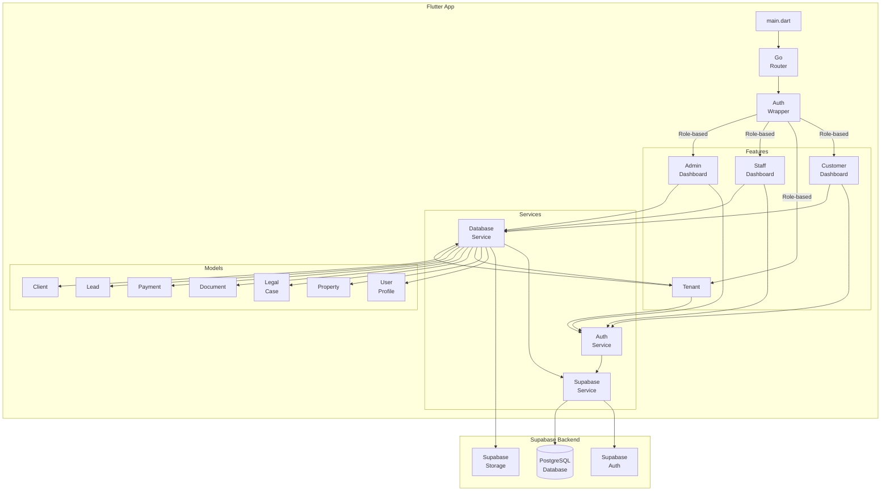
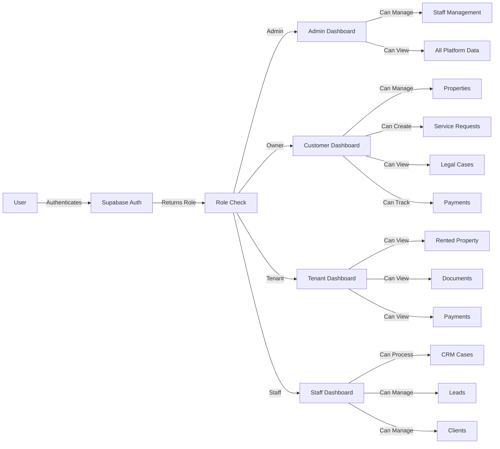
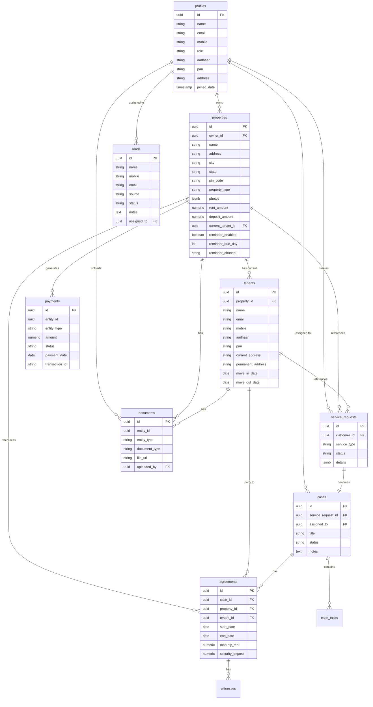
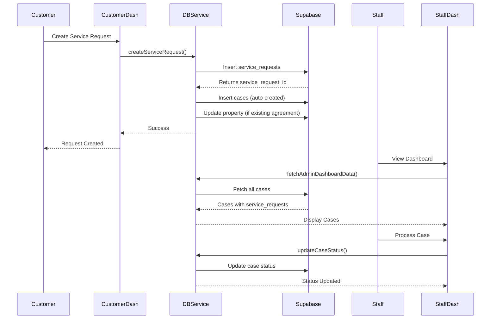

# Vakil Sirji Platform - Architecture Diagram

## Tech Stack
- **Frontend**: Flutter (cross-platform mobile/web)
- **Backend**: Supabase (PostgreSQL + Auth + Storage)
- **State Management**: Provider
- **Routing**: go_router
- **File Handling**: file_picker
- **Deep Linking**: url_launcher

## Architecture Overview



## User Roles & Dashboards



## Database Schema



## Data Flow: Service Request to Case



## Key Service Methods

### AuthService
- `signIn(email, password)` - User authentication
- `signUp(email, password, name, mobile, role)` - User registration
- `adminCreateStaff(email, password, name, mobile)` - Staff creation by admin
- `signOut()` - User logout
- Listens to Supabase auth state changes

### DatabaseService
- `fetchCustomerDashboardData(userId)` - Loads owner's properties, tenants, cases
- `fetchTenantDashboardData(userMobile)` - Loads tenant's property, payments, documents
- `fetchAdminDashboardData()` - Loads all platform data
- `createServiceRequest(customerId, serviceType, propertyId, tenantId)` - Creates request + case
- `addProperty()`, `updateProperty()`, `deleteProperty()` - Property CRUD
- `addTenant()`, `updateTenant()`, `deleteTenant()` - Tenant CRUD
- `uploadPropertyPhoto()`, `uploadDocument()` - File uploads
- `addPayment()`, `generateInvoice()` - Payment management
- `addLead()`, `updateLeadStatus()` - Lead management

## Feature Structure

```
lib/
├── core/
│   ├── constants.dart          # App colors, Supabase credentials
│   └── router.dart              # GoRouter configuration
├── services/
│   ├── auth_service.dart        # Authentication logic
│   ├── database_service.dart    # Data operations (806 lines)
│   └── supabase_service.dart    # Supabase initialization
├── models/
│   ├── user_profile.dart        # User roles enum + profile
│   ├── property.dart            # Property model
│   ├── tenant.dart              # Tenant model
│   ├── legal_case.dart          # Legal case model
│   ├── document.dart            # Document model
│   ├── payment.dart             # Payment model
│   ├── lead.dart                # Lead model
│   └── client.dart              # Client model
└── features/
    ├── auth/
    │   ├── auth_wrapper.dart    # Role-based routing
    │   ├── login_screen.dart    # Login UI
    │   └── register_screen.dart # Registration UI
    ├── customer/                # Owner dashboard (11 screens)
    ├── tenant/                  # Tenant dashboard (3 tabs)
    ├── crm/                     # Staff dashboard (11 screens)
    └── admin/                   # Admin dashboard (3 screens)
```

## Security Model

- **Row Level Security (RLS)** enabled on all tables
- **Profiles**: Users can only read/update their own profile
- **Properties**: Owners can only view/manage their properties
- **Service Requests**: Users can only view their own requests
- **Cases**: Staff can view all cases (for CRM operations)
- **Leads**: Staff can manage all leads

## Storage Buckets

- `properties` - Property photos
- `documents` - General documents (Aadhaar, PAN, etc.)
- `agreements` - Legal agreement documents
